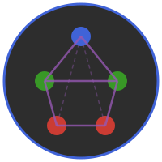

# ERGM.jl


[](https://github.com/statistical-network-analysis-with-Julia/ERGM.jl)
[](https://github.com/statistical-network-analysis-with-Julia/ERGM.jl/actions/workflows/CI.yml?query=branch%3Amain)
[](https://statistical-network-analysis-with-Julia.github.io/ERGM.jl/stable/)
[](https://statistical-network-analysis-with-Julia.github.io/ERGM.jl/dev/)
[](https://julialang.org/)
[](https://opensource.org/licenses/MIT)

<p align="center">
  
</p>

Exponential Random Graph Models for Julia.

## Overview

ERGM.jl provides tools for fitting, simulating, and diagnosing Exponential-Family Random Graph Models (ERGMs). ERGMs are statistical models for network structure that express the probability of observing a network as a function of network statistics.

This package is a Julia port of the R `ergm` package from the StatNet collection.

## Installation

Requires Julia 1.12+. ERGM.jl depends on the unregistered
[Network.jl](https://github.com/statistical-network-analysis-with-Julia/Network.jl) package, which must be added first:

```julia
using Pkg
Pkg.add(url="https://github.com/statistical-network-analysis-with-Julia/Network.jl")
Pkg.add(url="https://github.com/statistical-network-analysis-with-Julia/ERGM.jl")
```

For development, you can instead clone all ecosystem repositories side by
side (the monorepo layout) and start Julia with the root workspace project
(`julia --project=.` in the clone root): the `[sources]` path dependencies
then wire the packages together with no ordered installs needed.

## Features

- **Model terms**: Structural, nodal, and dyadic covariate terms
- **Estimation**: MPLE (fast) and MCMLE (full likelihood)
- **Simulation**: MCMC network simulation
- **Diagnostics**: Goodness-of-fit testing, MCMC diagnostics

## Quick Start

```julia
using Network
using ERGM

# Observed network: Padgett's Florentine marriage ties (bundled dataset)
net = load_dataset(:florentine_marriage)

# Define model terms. Attribute-based terms are validated at model
# construction: a typo'd attribute name throws an ArgumentError listing
# the attributes that do exist.
terms = [
    Edges(),
    NodeCov(:wealth)
]

# Fit model using MPLE
result = ergm(net, terms; method=:mple)
println(result)

# Simulate from fitted model
sim_nets = simulate_ergm(result; n_sim=100)
```

## Model Terms

### Structural Terms
<!-- skip-check -->
```julia
Edges()              # Edge count (density)
Mutual()             # Reciprocated edges (directed)
Triangle()           # Triangle count
Kstar(k)             # k-star count
TwoPath()            # Two-path count
Degree(d)            # Vertices with degree exactly d (undirected);
IDegree(d)           #   in-degree / out-degree variants for directed
ODegree(d)           #   networks; Degree(0:2) expands to one term per degree
GWESP(decay)         # Geometrically weighted ESP
                     # (directed: type=:OTP|:ITP|:OSP|:ISP|:union,
                     #  statnet dgwesp semantics, default :OTP)
GWDSP(decay)         # Geometrically weighted dyadwise shared partners
                     # (all dyads, tied or not; same directed types)
GWDegree(decay)      # Geometrically weighted degree
GWIDegree(decay)     # Geometrically weighted in-degree (directed)
GWODegree(decay)     # Geometrically weighted out-degree (directed)
```

> **Changed in 0.2**: on *directed* networks, `GWESP(decay)` (and `GWDSP`)
> previously counted either-direction ("union") shared partners while
> emitting statnet's OTP label `gwesp.fixed.<decay>` — a silently different
> model. The default is now statnet-compatible `:OTP`; the old statistic is
> available as `GWESP(decay; type=:union)` under the distinct label
> `gwesp.union.fixed.<decay>`. Directed models fit with 0.1 produce
> different coefficients when refit; undirected GWESP is unchanged. See
> [CHANGELOG.md](CHANGELOG.md).

### Nodal Terms
```julia
NodeFactor(:attr)           # Categorical main effect: one statistic per level,
                            # first (sorted) level dropped as the reference
                            # (statnet nodefactor; base=0 keeps all levels)
NodeCov(:attr)              # Continuous node attribute
NodeMatch(:attr)            # Uniform homophily on attribute
NodeMatch(:attr; diff=true, level="A")  # Differential (per-level) homophily,
                                        # as in R nodematch(diff=TRUE):
                                        # one term per attribute level
NodeMismatch(:attr)         # Mismatched-edges count (heterophily)
NodeMix(:attr)              # Mixing-matrix cell counts (statnet nodemix;
                            # first cell dropped as the reference)
AbsDiff(:attr)              # Absolute difference effect
```

> **Changed in 0.2**: `NodeFactor(attr)` previously produced a single
> statistic counting endpoint appearances across *all* levels — collinear
> with `Edges()` by construction. It now matches statnet: one statistic
> per level with the first (sorted) level as the reference. Pass `base=0`
> for the old all-levels behavior (as separate per-level statistics).

> **Changed in 0.2**: `NodeMatch(attr; diff=true)` previously counted
> *mismatching* dyads — the opposite of R, where `nodematch(diff=TRUE)`
> means differential (per-level) homophily. `diff=true` is now
> R-compatible per-level homophily (`nodematch.<attr>.<level>` naming, and
> it requires `level=` rather than guessing); the old mismatch statistic
> moved to the new `NodeMismatch(attr)` term. See
> [CHANGELOG.md](CHANGELOG.md) for the full 0.2 migration notes.

### Dyadic Terms
<!-- skip-check -->
```julia
EdgeCov(matrix)      # Edge covariate
```

## Model Fitting

```julia
# Maximum Pseudo-Likelihood (fast, approximate)
result = ergm(net, terms; method=:mple)

# Monte Carlo MLE (slower, exact)
result = ergm(net, terms; method=:mcmle)

# Access results
coef(result)         # Coefficients
stderror(result)     # Standard errors
```

Model construction fails loudly on user errors: attribute-based terms whose
vertex attribute does not exist on the network, and intrinsically directed
terms (e.g. `Mutual()`) on undirected networks, both throw an
`ArgumentError` (as in R ergm) instead of silently fitting a wrong model.

### Honest MPLE uncertainty

For models with dyad-**dependent** terms (`Triangle()`, `GWESP(...)`, ...)
the default inverse-Hessian MPLE standard errors are anticonservative —
the pseudo-likelihood treats dependent dyads as independent observations —
and `show(result)` prints a caveat (as statnet does). For honest standard
errors, use the parametric bootstrap or refit with `method=:mcmle`:

```julia
result = ergm(net, terms; method=:mple, se=:bootstrap, n_boot=100)
```

For dyad-independent models the pseudo-likelihood is the true likelihood
and the default SEs are correct (no caveat is printed).

MCMLE's reported log-likelihood (hence AIC/BIC) is estimated by an
ergm-style path-sampling (bridge) ladder from a dyad-independent reference
to the fitted coefficients (`bridge_rungs` keyword), which is far more
accurate than one-jump importance sampling.

### Missing (unobserved) dyads

If dyads of the network are masked as missing with Network.jl's
`set_missing_dyad!` (tie status unobserved — distinct from "no tie"):

- **MPLE** excludes masked dyads from the design matrix: they are not
  observed responses, so they contribute no logistic-regression row and
  `nobs` decreases accordingly. Their face values still condition the
  change statistics of the observed dyads.
- **MCMLE and simulation** hold masked dyads fixed at their face value —
  the MH sampler never toggles them — and `mcmle` emits a one-time warning
  that it *conditions* on those face values. This is an honest, clearly
  labeled approximation: full statnet-style missing-data maximum likelihood
  is not yet implemented.

```julia
set_missing_dyad!(net, 3, 4)          # 3->4 was not measured
fit = ergm(net, terms; method=:mple)  # 3->4 excluded from the pseudo-likelihood
nobs(fit)                             # one fewer observation
```

## Simulation

```julia
# Simulate networks from fitted model
sim_nets = simulate_ergm(result; n_sim=100)

# Simulate from parameters directly
model = ERGMModel(ERGMFormula(terms), net)
sim_nets = sample_networks(model, coef(result);
                           n_sim=100, burnin=1000)

# Low-level single-chain sampler: sampled sufficient statistics
# (and optionally networks) from one parameterized MH chain
using Random
out = mh_sample(model, coef(result); n_samples=500, rng=Xoshiro(1))
out.stats            # n_samples × p matrix of sampled statistics
```

All sampling and fitting functions accept an `rng::AbstractRNG` keyword;
runs with the same seed are exactly reproducible. `sample_networks`,
`simulate_ergm`, and `gof` split their draws over independent chains run
on separate threads (`n_chains` keyword), seeded deterministically from
the caller's `rng`, so results are also independent of the thread count.

## Goodness-of-Fit

`gof` is a method of the ecosystem-wide `Network.gof` generic — the same
verb works on every fitted model in the ecosystem. For directed networks
the degree comparison is split into in- and out-degree distributions
(`:idegree`/`:odegree`), as in R ergm:

```julia
# GOF diagnostics
gof_result = gof(result; stats=[:degree, :esp, :distance])
# on a directed fit, :degree yields the :idegree and :odegree panels

# MCMC diagnostics (requires an MCMLE fit; throws an
# ArgumentError for MPLE fits, which have no MCMC samples)
mcmle_result = ergm(net, terms; method=:mcmle)
mcmc_diagnostics(mcmle_result)
```

## Shared optimization utility

`newton_fit(loglik_grad_hess, θ0)` is a public Newton–Raphson maximizer
with step halving for packages building likelihood-based network models on
top of ERGM.jl: pass a function `θ -> (ll, grad, hess)` and get back
`(θ, se, vcov, loglik, converged, iterations)`.

## Change Statistics

For efficient MCMC, each term implements `change_stat()`, the add-direction
change statistic `g(y⁺ᵢⱼ) − g(y⁻ᵢⱼ)` — the statistic with edge (i,j) present
minus the statistic with it absent. Its value does not depend on whether the
edge currently exists:

<!-- skip-check -->
```julia
# Change in statistic from adding edge (i,j), given the rest of the network
delta = change_stat(term, net, i, j)
```

## Custom Terms

See ERGMUserterms.jl for templates and utilities for developing custom terms.

## Mathematical Background

An ERGM has the form:

```
P(Y = y) = exp(θ'g(y)) / c(θ)
```

Where:
- `Y` is the random network
- `y` is an observed network
- `θ` is the parameter vector
- `g(y)` is the vector of sufficient statistics
- `c(θ)` is the normalizing constant

## Documentation

For more detailed documentation, see:

- [Stable Documentation](https://statistical-network-analysis-with-Julia.github.io/ERGM.jl/stable/)
- [Development Documentation](https://statistical-network-analysis-with-Julia.github.io/ERGM.jl/dev/)

## References

1. Hunter, D. R., & Handcock, M. S. (2006). Inference in curved exponential family models for networks. *Journal of Computational and Graphical Statistics*, 15(3), 565-583.

2. Robins, G., Pattison, P., Kalish, Y., & Lusher, D. (2007). An introduction to exponential random graph (p*) models for social networks. *Social Networks*, 29(2), 173-191.

3. Hunter, D. R., Handcock, M. S., Butts, C. T., Goodreau, S. M., & Morris, M. (2008). ergm: A Package to Fit, Simulate and Diagnose Exponential-Family Models for Networks. *Journal of Statistical Software*, 24(3), 1-29.

## License

MIT License - see [LICENSE](LICENSE) for details.
